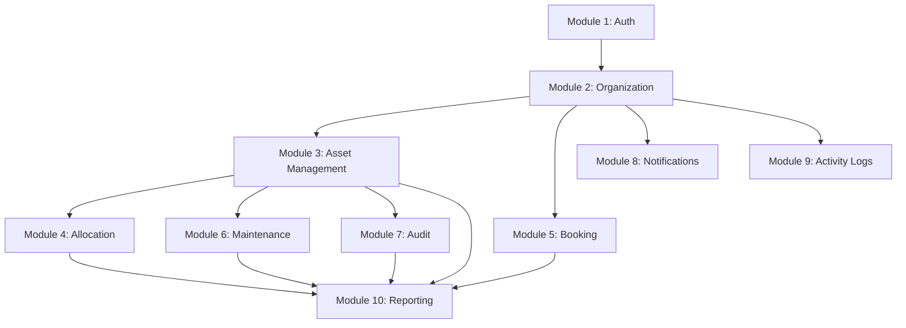

# AssetFlow — Complete PostgreSQL Database Architecture

> **Version**: 1.0  
> **Date**: 2026-07-12  
> **Database**: PostgreSQL 15+  
> **ORM**: Prisma (Node.js / Express.js)  
> **Normalization**: Third Normal Form (3NF)

---

## Table of Contents

1. [Overall Database Architecture](#1-overall-database-architecture)
2. [Module Breakdown](#2-module-breakdown)
3. [Complete Table List](#3-complete-table-list)
4. [Database Naming Convention](#4-database-naming-convention)
5. [PostgreSQL ENUM Definitions](#5-postgresql-enum-definitions)
6. [Detailed Table Definitions](#6-detailed-table-definitions)
   - [Module 1: Authentication & Authorization](#module-1-authentication--authorization)
   - [Module 2: Organization Setup](#module-2-organization-setup)
   - [Module 3: Asset Management](#module-3-asset-management)
   - [Module 4: Asset Allocation](#module-4-asset-allocation)
   - [Module 5: Resource Booking](#module-5-resource-booking)
   - [Module 6: Maintenance](#module-6-maintenance)
   - [Module 7: Asset Audit](#module-7-asset-audit)
   - [Module 8: Notifications](#module-8-notifications)
   - [Module 9: Activity Logs](#module-9-activity-logs)
   - [Module 10: Reporting (Views)](#module-10-reporting-views)
7. [Relationships](#7-relationships)
8. [ER Diagram](#8-er-diagram)
9. [Normalization Explanation](#9-normalization-explanation)
10. [Index Recommendations](#10-index-recommendations)
11. [Business Rules — Database Enforcement](#11-business-rules--database-enforcement)
12. [PostgreSQL Views](#12-postgresql-views)
13. [Prisma ORM Compatibility](#13-prisma-orm-compatibility)
14. [Future Scalability Suggestions](#14-future-scalability-suggestions)
15. [Final Database Summary](#15-final-database-summary)

---

## 1. Overall Database Architecture

AssetFlow's database is organized into **10 functional modules** that mirror the application's domain boundaries. Every module is self-contained but connected to others through well-defined foreign key relationships.

```
┌─────────────────────────────────────────────────────────────────────────┐
│                          AssetFlow Database                             │
│                                                                         │
│  ┌──────────────┐  ┌──────────────┐  ┌──────────────┐                  │
│  │   Module 1   │  │   Module 2   │  │   Module 3   │                  │
│  │  Auth & Authz│  │ Organization │  │    Asset      │                  │
│  │  5 tables    │──│  5 tables    │──│  Management   │                  │
│  └──────────────┘  └──────────────┘  │  4 tables     │                  │
│                                      └───────┬───────┘                  │
│                          ┌───────────────────┼───────────────────┐      │
│                          ▼                   ▼                   ▼      │
│                   ┌──────────────┐  ┌──────────────┐  ┌──────────────┐ │
│                   │   Module 4   │  │   Module 6   │  │   Module 7   │ │
│                   │  Allocation  │  │ Maintenance  │  │    Audit     │ │
│                   │  3 tables    │  │  5 tables    │  │  4 tables    │ │
│                   └──────────────┘  └──────────────┘  └──────────────┘ │
│                                                                         │
│  ┌──────────────┐  ┌──────────────┐  ┌──────────────┐                  │
│  │   Module 5   │  │   Module 8   │  │   Module 9   │                  │
│  │   Booking    │  │ Notifications│  │ Activity Logs│                  │
│  │  3 tables    │  │  2 tables    │  │  1 table     │                  │
│  └──────────────┘  └──────────────┘  └──────────────┘                  │
│                                                                         │
│  ┌──────────────────────────────────────────────────┐                  │
│  │              Module 10: Reporting                 │                  │
│  │              6 PostgreSQL Views                   │                  │
│  └──────────────────────────────────────────────────┘                  │
└─────────────────────────────────────────────────────────────────────────┘
```

### Architecture Principles

| Principle | Implementation |
|---|---|
| **Normalization** | 3NF throughout; JSONB only for truly dynamic data |
| **History Preservation** | Dedicated history tables; no overwrites of operational data |
| **Role-Based Access** | Roles table + user_roles bridge; all roles are rows, not tables |
| **Soft State Transitions** | ENUM status fields + history tracking; no physical deletes |
| **Referential Integrity** | Foreign keys on every relationship; no orphan records |
| **Temporal Accuracy** | `TIMESTAMPTZ` for all timestamps; UTC storage |
| **Search Performance** | Targeted indexes, partial indexes, GIN/GiST where needed |

### Required PostgreSQL Extensions

```sql
CREATE EXTENSION IF NOT EXISTS "pgcrypto";    -- gen_random_uuid()
CREATE EXTENSION IF NOT EXISTS "pg_trgm";     -- Trigram search on asset names
CREATE EXTENSION IF NOT EXISTS "btree_gist";  -- GiST exclusion for booking overlap
```

---

## 2. Module Breakdown

| Module | Name | Tables | Purpose |
|---|---|---|---|
| 1 | Authentication & Authorization | 5 | User accounts, roles, sessions, password resets |
| 2 | Organization Setup | 5 | Departments, employees, categories, locations |
| 3 | Asset Management | 4 | Master asset register, images, documents, status history |
| 4 | Asset Allocation | 3 | Allocations, transfers, returns |
| 5 | Resource Booking | 3 | Bookable resources, bookings, participants |
| 6 | Maintenance | 5 | Requests, approvals, assignments, history, attachments |
| 7 | Asset Audit | 4 | Audit cycles, assignments, item results, discrepancies |
| 8 | Notifications | 2 | Notification messages and multi-recipient delivery |
| 9 | Activity Logs | 1 | System-wide audit trail |
| 10 | Reporting | 6 views | Dashboard KPIs, utilization, stats (no physical tables) |

**Total: 32 tables + 6 views**

---

## 3. Complete Table List

### Physical Tables (32)

| # | Table Name | Module | Primary Purpose |
|---|---|---|---|
| 1 | `users` | Auth | Login credentials and account state |
| 2 | `roles` | Auth | Role definitions (admin, employee, etc.) |
| 3 | `user_roles` | Auth | Many-to-many: users ↔ roles |
| 4 | `user_sessions` | Auth | Active session / refresh token tracking |
| 5 | `password_reset_tokens` | Auth | Time-limited password reset tokens |
| 6 | `departments` | Organization | Department hierarchy (self-referencing) |
| 7 | `employees` | Organization | Employee profiles (1:1 with users) |
| 8 | `asset_categories` | Organization | Hierarchical asset classification |
| 9 | `category_custom_fields` | Organization | Dynamic metadata schema per category |
| 10 | `locations` | Organization | Physical sites, buildings, floors, rooms |
| 11 | `assets` | Asset Mgmt | Master asset register |
| 12 | `asset_images` | Asset Mgmt | Multiple images per asset |
| 13 | `asset_documents` | Asset Mgmt | Warranties, invoices, manuals |
| 14 | `asset_status_history` | Asset Mgmt | Complete status change audit trail |
| 15 | `asset_allocations` | Allocation | Current and historical allocation records |
| 16 | `asset_transfer_requests` | Allocation | Transfer workflow with approval |
| 17 | `asset_returns` | Allocation | Return records with condition assessment |
| 18 | `resources` | Booking | Bookable resources (rooms, projectors, etc.) |
| 19 | `resource_bookings` | Booking | Individual booking records |
| 20 | `booking_participants` | Booking | Many-to-many: bookings ↔ employees |
| 21 | `maintenance_requests` | Maintenance | Maintenance tickets / work orders |
| 22 | `maintenance_approvals` | Maintenance | Approval/rejection audit records |
| 23 | `maintenance_assignments` | Maintenance | Technician assignment records |
| 24 | `maintenance_history` | Maintenance | Status change log per request |
| 25 | `maintenance_attachments` | Maintenance | Photos, documents for maintenance |
| 26 | `audit_cycles` | Audit | Audit campaigns / periods |
| 27 | `audit_assignments` | Audit | Auditor ↔ department assignments |
| 28 | `audit_items` | Audit | Per-asset audit verification results |
| 29 | `discrepancy_reports` | Audit | Issues found during audit |
| 30 | `notifications` | Notifications | Notification message records |
| 31 | `notification_recipients` | Notifications | Multi-recipient delivery tracking |
| 32 | `activity_logs` | Activity Logs | System-wide action audit trail |

### Views (6)

| # | View Name | Purpose |
|---|---|---|
| V1 | `vw_dashboard_kpis` | Aggregate counts for main dashboard |
| V2 | `vw_asset_utilization` | Asset usage rates and idle tracking |
| V3 | `vw_department_summary` | Per-department asset and employee rollup |
| V4 | `vw_maintenance_statistics` | Resolution times, costs, status breakdown |
| V5 | `vw_booking_analytics` | Resource utilization and peak-hour analysis |
| V6 | `vw_audit_reports` | Audit results and discrepancy rates |

---

## 4. Database Naming Convention

| Element | Convention | Example |
|---|---|---|
| Tables | `snake_case`, **plural** nouns | `assets`, `employees`, `audit_cycles` |
| Columns | `snake_case` | `created_at`, `asset_status`, `first_name` |
| Primary Keys | Always `id` | `id UUID DEFAULT gen_random_uuid()` |
| Foreign Keys | `<referenced_table_singular>_id` | `department_id`, `employee_id`, `asset_id` |
| Self-referencing FKs | `parent_<table_singular>_id` | `parent_department_id`, `parent_category_id` |
| ENUMs | `PascalCase` | `AssetStatus`, `BookingStatus` |
| Indexes | `idx_<table>_<column(s)>` | `idx_assets_status`, `idx_employees_name` |
| Unique Constraints | `uq_<table>_<column(s)>` | `uq_users_email` |
| Check Constraints | `chk_<table>_<rule>` | `chk_bookings_time_range` |
| Views | `vw_<descriptive_name>` | `vw_dashboard_kpis` |
| Timestamps | `<event>_at` suffix | `created_at`, `resolved_at`, `closed_at` |
| Booleans | `is_<adjective>` or `has_<noun>` prefix | `is_active`, `is_read`, `is_resolved` |

---

## 5. PostgreSQL ENUM Definitions

### 5.1 AssetStatus

```sql
CREATE TYPE "AssetStatus" AS ENUM (
  'available',
  'allocated',
  'reserved',
  'under_maintenance',
  'lost',
  'retired',
  'disposed'
);
```

**State transitions:**
```
available ──▶ allocated ──▶ available (via return)
available ──▶ reserved ──▶ allocated
available ──▶ under_maintenance ──▶ available
    *     ──▶ lost
    *     ──▶ retired
    *     ──▶ disposed
```

### 5.2 BookingStatus

```sql
CREATE TYPE "BookingStatus" AS ENUM (
  'upcoming',
  'ongoing',
  'completed',
  'cancelled'
);
```

### 5.3 MaintenanceStatus

```sql
CREATE TYPE "MaintenanceStatus" AS ENUM (
  'pending',
  'approved',
  'rejected',
  'technician_assigned',
  'in_progress',
  'resolved',
  'closed'
);
```

**State transitions:**
```
pending ──▶ approved ──▶ technician_assigned ──▶ in_progress ──▶ resolved ──▶ closed
pending ──▶ rejected
```

### 5.4 MaintenanceType

```sql
CREATE TYPE "MaintenanceType" AS ENUM (
  'preventive',
  'corrective',
  'emergency'
);
```

### 5.5 AuditResult

```sql
CREATE TYPE "AuditResult" AS ENUM (
  'verified',
  'missing',
  'damaged'
);
```

### 5.6 AuditCycleStatus

```sql
CREATE TYPE "AuditCycleStatus" AS ENUM (
  'planned',
  'in_progress',
  'completed',
  'closed'
);
```

### 5.7 EmployeeStatus

```sql
CREATE TYPE "EmployeeStatus" AS ENUM (
  'active',
  'inactive'
);
```

### 5.8 DepartmentStatus

```sql
CREATE TYPE "DepartmentStatus" AS ENUM (
  'active',
  'inactive'
);
```

### 5.9 TransferRequestStatus

```sql
CREATE TYPE "TransferRequestStatus" AS ENUM (
  'pending',
  'approved',
  'rejected',
  'completed'
);
```

### 5.10 AllocationStatus

```sql
CREATE TYPE "AllocationStatus" AS ENUM (
  'active',
  'returned',
  'transferred'
);
```

### 5.11 NotificationType

```sql
CREATE TYPE "NotificationType" AS ENUM (
  'info',
  'warning',
  'action_required',
  'system'
);
```

### 5.12 ResourceType

```sql
CREATE TYPE "ResourceType" AS ENUM (
  'meeting_room',
  'projector',
  'vehicle',
  'lab_equipment',
  'other'
);
```

### 5.13 ApprovalAction

```sql
CREATE TYPE "ApprovalAction" AS ENUM (
  'approved',
  'rejected'
);
```

---

## 6. Detailed Table Definitions

Each table definition includes: columns, data types, primary keys, foreign keys, constraints, and indexes.

---

### Module 1: Authentication & Authorization

---

#### 6.1 `users`

Stores login credentials and account state. Every person interacting with AssetFlow has exactly one `users` record. Roles are assigned via the `user_roles` bridge table — **Admin is a role, not a separate table.**

| Column | Data Type | Nullable | Default | Constraints |
|---|---|---|---|---|
| `id` | `UUID` | NO | `gen_random_uuid()` | **PRIMARY KEY** |
| `email` | `VARCHAR(255)` | NO | — | **UNIQUE**, NOT NULL |
| `password_hash` | `VARCHAR(255)` | NO | — | NOT NULL |
| `is_active` | `BOOLEAN` | NO | `true` | NOT NULL |
| `email_verified` | `BOOLEAN` | NO | `false` | NOT NULL |
| `last_login_at` | `TIMESTAMPTZ` | YES | — | |
| `created_at` | `TIMESTAMPTZ` | NO | `NOW()` | NOT NULL |
| `updated_at` | `TIMESTAMPTZ` | NO | `NOW()` | NOT NULL |

**Primary Key:** `id`  
**Unique Constraints:** `email`  
**Foreign Keys:** None  
**Indexes:**
| Index Name | Column(s) | Type | Notes |
|---|---|---|---|
| `(implicit from UNIQUE)` | `email` | B-tree UNIQUE | Login lookup |

---

#### 6.2 `roles`

Pre-seeded role definitions. The application seeds 6 roles on first deployment.

| Column | Data Type | Nullable | Default | Constraints |
|---|---|---|---|---|
| `id` | `UUID` | NO | `gen_random_uuid()` | **PRIMARY KEY** |
| `name` | `VARCHAR(50)` | NO | — | **UNIQUE**, NOT NULL |
| `description` | `VARCHAR(255)` | YES | — | |
| `created_at` | `TIMESTAMPTZ` | NO | `NOW()` | NOT NULL |

**Primary Key:** `id`  
**Unique Constraints:** `name`

**Seed Data:**

| name | description |
|---|---|
| `admin` | Full system access, user management, role promotion |
| `asset_manager` | Asset CRUD, allocations, returns, maintenance oversight |
| `department_head` | Department asset oversight, transfer/maintenance approval |
| `employee` | View own assets, request maintenance, book resources |
| `auditor` | Conduct audits, submit findings, create discrepancy reports |
| `technician` | View assigned maintenance, update progress, resolve tickets |

---

#### 6.3 `user_roles`

Bridge table supporting multiple roles per user. An employee who is also an auditor has two rows.

| Column | Data Type | Nullable | Default | Constraints |
|---|---|---|---|---|
| `id` | `UUID` | NO | `gen_random_uuid()` | **PRIMARY KEY** |
| `user_id` | `UUID` | NO | — | **FK → `users.id`**, NOT NULL |
| `role_id` | `UUID` | NO | — | **FK → `roles.id`**, NOT NULL |
| `assigned_by` | `UUID` | YES | — | **FK → `users.id`** |
| `assigned_at` | `TIMESTAMPTZ` | NO | `NOW()` | NOT NULL |

**Primary Key:** `id`  
**Unique Constraints:** `(user_id, role_id)` — prevents duplicate role assignments  
**Foreign Keys:**

| Column | References | On Delete |
|---|---|---|
| `user_id` | `users.id` | CASCADE |
| `role_id` | `roles.id` | RESTRICT |
| `assigned_by` | `users.id` | SET NULL |

**Indexes:**

| Index Name | Column(s) | Type |
|---|---|---|
| `idx_user_roles_user_id` | `user_id` | B-tree |
| `idx_user_roles_role_id` | `role_id` | B-tree |

---

#### 6.4 `user_sessions`

Tracks active sessions / refresh tokens for token-based authentication.

| Column | Data Type | Nullable | Default | Constraints |
|---|---|---|---|---|
| `id` | `UUID` | NO | `gen_random_uuid()` | **PRIMARY KEY** |
| `user_id` | `UUID` | NO | — | **FK → `users.id`**, NOT NULL |
| `token_hash` | `VARCHAR(255)` | NO | — | **UNIQUE**, NOT NULL |
| `ip_address` | `INET` | YES | — | |
| `user_agent` | `TEXT` | YES | — | |
| `expires_at` | `TIMESTAMPTZ` | NO | — | NOT NULL |
| `created_at` | `TIMESTAMPTZ` | NO | `NOW()` | NOT NULL |

**Primary Key:** `id`  
**Foreign Keys:**

| Column | References | On Delete |
|---|---|---|
| `user_id` | `users.id` | CASCADE |

**Indexes:**

| Index Name | Column(s) | Type |
|---|---|---|
| `idx_user_sessions_user_id` | `user_id` | B-tree |
| `idx_user_sessions_expires_at` | `expires_at` | B-tree |

---

#### 6.5 `password_reset_tokens`

One-time-use tokens for password reset flow. `used_at` is set when consumed.

| Column | Data Type | Nullable | Default | Constraints |
|---|---|---|---|---|
| `id` | `UUID` | NO | `gen_random_uuid()` | **PRIMARY KEY** |
| `user_id` | `UUID` | NO | — | **FK → `users.id`**, NOT NULL |
| `token_hash` | `VARCHAR(255)` | NO | — | **UNIQUE**, NOT NULL |
| `expires_at` | `TIMESTAMPTZ` | NO | — | NOT NULL |
| `used_at` | `TIMESTAMPTZ` | YES | — | NULL until consumed |
| `created_at` | `TIMESTAMPTZ` | NO | `NOW()` | NOT NULL |

**Primary Key:** `id`  
**Foreign Keys:**

| Column | References | On Delete |
|---|---|---|
| `user_id` | `users.id` | CASCADE |

**Indexes:**

| Index Name | Column(s) | Type |
|---|---|---|
| `idx_password_reset_tokens_user_id` | `user_id` | B-tree |

---

### Module 2: Organization Setup

---

#### 6.6 `departments`

Self-referencing hierarchy. `parent_department_id` points to the parent department (NULL for top-level). `head_employee_id` designates the department head.

| Column | Data Type | Nullable | Default | Constraints |
|---|---|---|---|---|
| `id` | `UUID` | NO | `gen_random_uuid()` | **PRIMARY KEY** |
| `name` | `VARCHAR(100)` | NO | — | NOT NULL |
| `code` | `VARCHAR(20)` | NO | — | **UNIQUE**, NOT NULL |
| `description` | `TEXT` | YES | — | |
| `parent_department_id` | `UUID` | YES | — | **FK → `departments.id`** (self-ref) |
| `head_employee_id` | `UUID` | YES | — | **FK → `employees.id`** |
| `status` | `"DepartmentStatus"` | NO | `'active'` | NOT NULL |
| `created_at` | `TIMESTAMPTZ` | NO | `NOW()` | NOT NULL |
| `updated_at` | `TIMESTAMPTZ` | NO | `NOW()` | NOT NULL |

**Primary Key:** `id`  
**Unique Constraints:** `code`  
**Foreign Keys:**

| Column | References | On Delete |
|---|---|---|
| `parent_department_id` | `departments.id` | SET NULL |
| `head_employee_id` | `employees.id` | SET NULL |

**Indexes:**

| Index Name | Column(s) | Type |
|---|---|---|
| `idx_departments_parent_id` | `parent_department_id` | B-tree |
| `idx_departments_status` | `status` | B-tree |

> **Note:** There is a circular FK between `departments.head_employee_id → employees.id` and `employees.department_id → departments.id`. In PostgreSQL, one FK must be created as `DEFERRABLE INITIALLY DEFERRED` to allow insertion of both records in a single transaction.

---

#### 6.7 `employees`

Employee profiles. Every employee has exactly one `users` record (1:1). The `user_id` is UNIQUE to enforce this.

| Column | Data Type | Nullable | Default | Constraints |
|---|---|---|---|---|
| `id` | `UUID` | NO | `gen_random_uuid()` | **PRIMARY KEY** |
| `user_id` | `UUID` | NO | — | **FK → `users.id`**, **UNIQUE**, NOT NULL |
| `employee_code` | `VARCHAR(20)` | NO | — | **UNIQUE**, NOT NULL |
| `first_name` | `VARCHAR(100)` | NO | — | NOT NULL |
| `last_name` | `VARCHAR(100)` | NO | — | NOT NULL |
| `email` | `VARCHAR(255)` | NO | — | NOT NULL |
| `phone` | `VARCHAR(20)` | YES | — | |
| `designation` | `VARCHAR(100)` | YES | — | Job title |
| `department_id` | `UUID` | YES | — | **FK → `departments.id`** |
| `location_id` | `UUID` | YES | — | **FK → `locations.id`** |
| `status` | `"EmployeeStatus"` | NO | `'active'` | NOT NULL |
| `date_of_joining` | `DATE` | YES | — | |
| `avatar_url` | `VARCHAR(500)` | YES | — | |
| `created_at` | `TIMESTAMPTZ` | NO | `NOW()` | NOT NULL |
| `updated_at` | `TIMESTAMPTZ` | NO | `NOW()` | NOT NULL |

**Primary Key:** `id`  
**Unique Constraints:** `user_id`, `employee_code`  
**Foreign Keys:**

| Column | References | On Delete |
|---|---|---|
| `user_id` | `users.id` | CASCADE |
| `department_id` | `departments.id` | SET NULL |
| `location_id` | `locations.id` | SET NULL |

**Indexes:**

| Index Name | Column(s) | Type | Notes |
|---|---|---|---|
| `idx_employees_department_id` | `department_id` | B-tree | Department lookup |
| `idx_employees_status` | `status` | B-tree | Filter active/inactive |
| `idx_employees_name` | `(first_name, last_name)` | B-tree | Name search |
| `idx_employees_location_id` | `location_id` | B-tree | Location filter |

---

#### 6.8 `asset_categories`

Hierarchical classification. `parent_category_id` enables nesting (e.g., Electronics → Laptops → Dell Laptops).

| Column | Data Type | Nullable | Default | Constraints |
|---|---|---|---|---|
| `id` | `UUID` | NO | `gen_random_uuid()` | **PRIMARY KEY** |
| `name` | `VARCHAR(100)` | NO | — | NOT NULL |
| `code` | `VARCHAR(20)` | NO | — | **UNIQUE**, NOT NULL |
| `description` | `TEXT` | YES | — | |
| `parent_category_id` | `UUID` | YES | — | **FK → `asset_categories.id`** (self-ref) |
| `is_active` | `BOOLEAN` | NO | `true` | NOT NULL |
| `created_at` | `TIMESTAMPTZ` | NO | `NOW()` | NOT NULL |
| `updated_at` | `TIMESTAMPTZ` | NO | `NOW()` | NOT NULL |

**Primary Key:** `id`  
**Unique Constraints:** `code`  
**Foreign Keys:**

| Column | References | On Delete |
|---|---|---|
| `parent_category_id` | `asset_categories.id` | SET NULL |

**Indexes:**

| Index Name | Column(s) | Type |
|---|---|---|
| `idx_asset_categories_parent_id` | `parent_category_id` | B-tree |

---

#### 6.9 `category_custom_fields`

Dynamic metadata schema per category. Allows categories like "Laptops" to define fields like "RAM Size" and "Screen Size" without altering the `assets` table.

| Column | Data Type | Nullable | Default | Constraints |
|---|---|---|---|---|
| `id` | `UUID` | NO | `gen_random_uuid()` | **PRIMARY KEY** |
| `category_id` | `UUID` | NO | — | **FK → `asset_categories.id`**, NOT NULL |
| `field_name` | `VARCHAR(100)` | NO | — | NOT NULL |
| `field_type` | `VARCHAR(50)` | NO | — | NOT NULL |
| `is_required` | `BOOLEAN` | NO | `false` | NOT NULL |
| `options` | `JSONB` | YES | — | For select-type: `["8GB","16GB"]` |
| `display_order` | `INTEGER` | NO | `0` | NOT NULL |
| `created_at` | `TIMESTAMPTZ` | NO | `NOW()` | NOT NULL |

**Primary Key:** `id`  
**Unique Constraints:** `(category_id, field_name)` — no duplicate field names per category  
**Check Constraints:**
- `chk_custom_fields_type`: `field_type IN ('text', 'number', 'date', 'boolean', 'select')`

**Foreign Keys:**

| Column | References | On Delete |
|---|---|---|
| `category_id` | `asset_categories.id` | CASCADE |

**Indexes:**

| Index Name | Column(s) | Type |
|---|---|---|
| `idx_category_custom_fields_category_id` | `category_id` | B-tree |

---

#### 6.10 `locations`

Physical locations. Granularity: site → building → floor → room.

| Column | Data Type | Nullable | Default | Constraints |
|---|---|---|---|---|
| `id` | `UUID` | NO | `gen_random_uuid()` | **PRIMARY KEY** |
| `name` | `VARCHAR(100)` | NO | — | NOT NULL |
| `code` | `VARCHAR(20)` | NO | — | **UNIQUE**, NOT NULL |
| `address` | `TEXT` | YES | — | |
| `building` | `VARCHAR(100)` | YES | — | |
| `floor` | `VARCHAR(20)` | YES | — | |
| `room` | `VARCHAR(50)` | YES | — | |
| `is_active` | `BOOLEAN` | NO | `true` | NOT NULL |
| `created_at` | `TIMESTAMPTZ` | NO | `NOW()` | NOT NULL |
| `updated_at` | `TIMESTAMPTZ` | NO | `NOW()` | NOT NULL |

**Primary Key:** `id`  
**Unique Constraints:** `code`  
**Foreign Keys:** None

---

### Module 3: Asset Management

---

#### 6.11 `assets`

The master asset register. Every physical or digital asset tracked by the organization has one row.

| Column | Data Type | Nullable | Default | Constraints |
|---|---|---|---|---|
| `id` | `UUID` | NO | `gen_random_uuid()` | **PRIMARY KEY** |
| `asset_code` | `VARCHAR(50)` | NO | — | **UNIQUE**, NOT NULL |
| `name` | `VARCHAR(200)` | NO | — | NOT NULL |
| `description` | `TEXT` | YES | — | |
| `category_id` | `UUID` | NO | — | **FK → `asset_categories.id`**, NOT NULL |
| `department_id` | `UUID` | YES | — | **FK → `departments.id`** |
| `location_id` | `UUID` | YES | — | **FK → `locations.id`** |
| `status` | `"AssetStatus"` | NO | `'available'` | NOT NULL |
| `serial_number` | `VARCHAR(100)` | YES | — | **UNIQUE** (nullable) |
| `model` | `VARCHAR(100)` | YES | — | |
| `manufacturer` | `VARCHAR(100)` | YES | — | |
| `purchase_date` | `DATE` | YES | — | |
| `purchase_cost` | `DECIMAL(15,2)` | YES | — | |
| `warranty_expiry_date` | `DATE` | YES | — | |
| `expected_life_years` | `INTEGER` | YES | — | |
| `custom_fields` | `JSONB` | YES | `'{}'` | Category-specific field values |
| `notes` | `TEXT` | YES | — | |
| `created_by` | `UUID` | YES | — | **FK → `employees.id`** |
| `created_at` | `TIMESTAMPTZ` | NO | `NOW()` | NOT NULL |
| `updated_at` | `TIMESTAMPTZ` | NO | `NOW()` | NOT NULL |

**Primary Key:** `id`  
**Unique Constraints:** `asset_code`, `serial_number`  
**Check Constraints:**
- `chk_assets_purchase_cost`: `purchase_cost >= 0 OR purchase_cost IS NULL`
- `chk_assets_life_years`: `expected_life_years > 0 OR expected_life_years IS NULL`

**Foreign Keys:**

| Column | References | On Delete |
|---|---|---|
| `category_id` | `asset_categories.id` | RESTRICT |
| `department_id` | `departments.id` | SET NULL |
| `location_id` | `locations.id` | SET NULL |
| `created_by` | `employees.id` | SET NULL |

**Indexes:**

| Index Name | Column(s) | Type | Notes |
|---|---|---|---|
| `idx_assets_category_id` | `category_id` | B-tree | Category filter |
| `idx_assets_department_id` | `department_id` | B-tree | Department filter |
| `idx_assets_location_id` | `location_id` | B-tree | Location filter |
| `idx_assets_status` | `status` | B-tree | Status filter |
| `idx_assets_serial_number` | `serial_number` | B-tree | Serial lookup |
| `idx_assets_name_trgm` | `name` | GIN (pg_trgm) | Full-text search |

---

#### 6.12 `asset_images`

Multiple images per asset. `is_primary` marks the thumbnail.

| Column | Data Type | Nullable | Default | Constraints |
|---|---|---|---|---|
| `id` | `UUID` | NO | `gen_random_uuid()` | **PRIMARY KEY** |
| `asset_id` | `UUID` | NO | — | **FK → `assets.id`**, NOT NULL |
| `image_url` | `VARCHAR(500)` | NO | — | NOT NULL |
| `caption` | `VARCHAR(200)` | YES | — | |
| `is_primary` | `BOOLEAN` | NO | `false` | NOT NULL |
| `display_order` | `INTEGER` | NO | `0` | NOT NULL |
| `uploaded_at` | `TIMESTAMPTZ` | NO | `NOW()` | NOT NULL |

**Primary Key:** `id`  
**Foreign Keys:**

| Column | References | On Delete |
|---|---|---|
| `asset_id` | `assets.id` | CASCADE |

**Indexes:**

| Index Name | Column(s) | Type |
|---|---|---|
| `idx_asset_images_asset_id` | `asset_id` | B-tree |

---

#### 6.13 `asset_documents`

Attached documents: warranties, purchase invoices, user manuals.

| Column | Data Type | Nullable | Default | Constraints |
|---|---|---|---|---|
| `id` | `UUID` | NO | `gen_random_uuid()` | **PRIMARY KEY** |
| `asset_id` | `UUID` | NO | — | **FK → `assets.id`**, NOT NULL |
| `document_name` | `VARCHAR(200)` | NO | — | NOT NULL |
| `document_type` | `VARCHAR(50)` | NO | — | NOT NULL |
| `file_url` | `VARCHAR(500)` | NO | — | NOT NULL |
| `file_size_bytes` | `BIGINT` | YES | — | |
| `uploaded_by` | `UUID` | YES | — | **FK → `employees.id`** |
| `uploaded_at` | `TIMESTAMPTZ` | NO | `NOW()` | NOT NULL |

**Primary Key:** `id`  
**Check Constraints:**
- `chk_asset_documents_type`: `document_type IN ('warranty', 'invoice', 'manual', 'other')`

**Foreign Keys:**

| Column | References | On Delete |
|---|---|---|
| `asset_id` | `assets.id` | CASCADE |
| `uploaded_by` | `employees.id` | SET NULL |

**Indexes:**

| Index Name | Column(s) | Type |
|---|---|---|
| `idx_asset_documents_asset_id` | `asset_id` | B-tree |

---

#### 6.14 `asset_status_history`

Immutable audit trail of every status change. Never modified after insertion.

| Column | Data Type | Nullable | Default | Constraints |
|---|---|---|---|---|
| `id` | `UUID` | NO | `gen_random_uuid()` | **PRIMARY KEY** |
| `asset_id` | `UUID` | NO | — | **FK → `assets.id`**, NOT NULL |
| `previous_status` | `"AssetStatus"` | YES | — | NULL for initial creation |
| `new_status` | `"AssetStatus"` | NO | — | NOT NULL |
| `changed_by` | `UUID` | YES | — | **FK → `employees.id`** |
| `reason` | `TEXT` | YES | — | |
| `changed_at` | `TIMESTAMPTZ` | NO | `NOW()` | NOT NULL |

**Primary Key:** `id`  
**Foreign Keys:**

| Column | References | On Delete |
|---|---|---|
| `asset_id` | `assets.id` | CASCADE |
| `changed_by` | `employees.id` | SET NULL |

**Indexes:**

| Index Name | Column(s) | Type |
|---|---|---|
| `idx_asset_status_history_asset_id` | `asset_id` | B-tree |
| `idx_asset_status_history_changed_at` | `changed_at` | B-tree |

---

### Module 4: Asset Allocation

---

#### 6.15 `asset_allocations`

Tracks who holds which asset. A **partial unique index** on `(asset_id) WHERE status = 'active'` ensures an asset can only have one active allocation at a time.

| Column | Data Type | Nullable | Default | Constraints |
|---|---|---|---|---|
| `id` | `UUID` | NO | `gen_random_uuid()` | **PRIMARY KEY** |
| `asset_id` | `UUID` | NO | — | **FK → `assets.id`**, NOT NULL |
| `employee_id` | `UUID` | NO | — | **FK → `employees.id`**, NOT NULL |
| `department_id` | `UUID` | NO | — | **FK → `departments.id`**, NOT NULL |
| `allocated_by` | `UUID` | NO | — | **FK → `employees.id`**, NOT NULL |
| `status` | `"AllocationStatus"` | NO | `'active'` | NOT NULL |
| `allocated_at` | `TIMESTAMPTZ` | NO | `NOW()` | NOT NULL |
| `expected_return_date` | `DATE` | YES | — | |
| `actual_return_date` | `TIMESTAMPTZ` | YES | — | Set on return |
| `notes` | `TEXT` | YES | — | |
| `created_at` | `TIMESTAMPTZ` | NO | `NOW()` | NOT NULL |
| `updated_at` | `TIMESTAMPTZ` | NO | `NOW()` | NOT NULL |

**Primary Key:** `id`  
**Partial Unique Index:** `UNIQUE(asset_id) WHERE status = 'active'` — **enforces "asset cannot be allocated twice"**  
**Foreign Keys:**

| Column | References | On Delete |
|---|---|---|
| `asset_id` | `assets.id` | RESTRICT |
| `employee_id` | `employees.id` | RESTRICT |
| `department_id` | `departments.id` | RESTRICT |
| `allocated_by` | `employees.id` | RESTRICT |

**Indexes:**

| Index Name | Column(s) | Type | Notes |
|---|---|---|---|
| `idx_asset_allocations_asset_id` | `asset_id` | B-tree | |
| `idx_asset_allocations_employee_id` | `employee_id` | B-tree | |
| `idx_asset_allocations_department_id` | `department_id` | B-tree | |
| `idx_asset_allocations_status` | `status` | B-tree | |
| `idx_asset_allocations_active_asset` | `asset_id` | B-tree UNIQUE (partial) | `WHERE status = 'active'` |

> **Design Note:** `department_id` is stored directly even though it can be derived from `employee_id → employees.department_id`. This is intentional: the allocation must preserve the department **at the time of allocation**, since employees may transfer departments later. This is point-in-time denormalization — correct for historical accuracy.

---

#### 6.16 `asset_transfer_requests`

Transfer workflow: request → approve/reject → complete.

| Column | Data Type | Nullable | Default | Constraints |
|---|---|---|---|---|
| `id` | `UUID` | NO | `gen_random_uuid()` | **PRIMARY KEY** |
| `allocation_id` | `UUID` | NO | — | **FK → `asset_allocations.id`**, NOT NULL |
| `asset_id` | `UUID` | NO | — | **FK → `assets.id`**, NOT NULL |
| `from_employee_id` | `UUID` | NO | — | **FK → `employees.id`**, NOT NULL |
| `to_employee_id` | `UUID` | NO | — | **FK → `employees.id`**, NOT NULL |
| `from_department_id` | `UUID` | NO | — | **FK → `departments.id`**, NOT NULL |
| `to_department_id` | `UUID` | NO | — | **FK → `departments.id`**, NOT NULL |
| `status` | `"TransferRequestStatus"` | NO | `'pending'` | NOT NULL |
| `requested_by` | `UUID` | NO | — | **FK → `employees.id`**, NOT NULL |
| `approved_by` | `UUID` | YES | — | **FK → `employees.id`** |
| `reason` | `TEXT` | YES | — | |
| `approved_at` | `TIMESTAMPTZ` | YES | — | |
| `completed_at` | `TIMESTAMPTZ` | YES | — | |
| `created_at` | `TIMESTAMPTZ` | NO | `NOW()` | NOT NULL |
| `updated_at` | `TIMESTAMPTZ` | NO | `NOW()` | NOT NULL |

**Primary Key:** `id`  
**Check Constraints:**
- `chk_transfer_not_self`: `from_employee_id != to_employee_id`

**Foreign Keys:**

| Column | References | On Delete |
|---|---|---|
| `allocation_id` | `asset_allocations.id` | RESTRICT |
| `asset_id` | `assets.id` | RESTRICT |
| `from_employee_id` | `employees.id` | RESTRICT |
| `to_employee_id` | `employees.id` | RESTRICT |
| `from_department_id` | `departments.id` | RESTRICT |
| `to_department_id` | `departments.id` | RESTRICT |
| `requested_by` | `employees.id` | RESTRICT |
| `approved_by` | `employees.id` | SET NULL |

**Indexes:**

| Index Name | Column(s) | Type |
|---|---|---|
| `idx_asset_transfer_requests_asset_id` | `asset_id` | B-tree |
| `idx_asset_transfer_requests_status` | `status` | B-tree |

---

#### 6.17 `asset_returns`

Records the return of an allocated asset, including condition assessment.

| Column | Data Type | Nullable | Default | Constraints |
|---|---|---|---|---|
| `id` | `UUID` | NO | `gen_random_uuid()` | **PRIMARY KEY** |
| `allocation_id` | `UUID` | NO | — | **FK → `asset_allocations.id`**, NOT NULL |
| `asset_id` | `UUID` | NO | — | **FK → `assets.id`**, NOT NULL |
| `returned_by` | `UUID` | NO | — | **FK → `employees.id`**, NOT NULL |
| `received_by` | `UUID` | NO | — | **FK → `employees.id`**, NOT NULL |
| `condition_notes` | `TEXT` | YES | — | |
| `return_condition` | `VARCHAR(50)` | NO | `'good'` | NOT NULL |
| `returned_at` | `TIMESTAMPTZ` | NO | `NOW()` | NOT NULL |
| `created_at` | `TIMESTAMPTZ` | NO | `NOW()` | NOT NULL |

**Primary Key:** `id`  
**Check Constraints:**
- `chk_return_condition`: `return_condition IN ('good', 'fair', 'damaged')`

**Foreign Keys:**

| Column | References | On Delete |
|---|---|---|
| `allocation_id` | `asset_allocations.id` | RESTRICT |
| `asset_id` | `assets.id` | RESTRICT |
| `returned_by` | `employees.id` | RESTRICT |
| `received_by` | `employees.id` | RESTRICT |

**Indexes:**

| Index Name | Column(s) | Type |
|---|---|---|
| `idx_asset_returns_allocation_id` | `allocation_id` | B-tree |
| `idx_asset_returns_asset_id` | `asset_id` | B-tree |

---

### Module 5: Resource Booking

---

#### 6.18 `resources`

Bookable resources: meeting rooms, projectors, vehicles, lab equipment.

| Column | Data Type | Nullable | Default | Constraints |
|---|---|---|---|---|
| `id` | `UUID` | NO | `gen_random_uuid()` | **PRIMARY KEY** |
| `name` | `VARCHAR(200)` | NO | — | NOT NULL |
| `resource_code` | `VARCHAR(50)` | NO | — | **UNIQUE**, NOT NULL |
| `resource_type` | `"ResourceType"` | NO | — | NOT NULL |
| `description` | `TEXT` | YES | — | |
| `location_id` | `UUID` | YES | — | **FK → `locations.id`** |
| `capacity` | `INTEGER` | YES | — | |
| `amenities` | `JSONB` | YES | `'[]'` | e.g., `["whiteboard", "projector"]` |
| `is_active` | `BOOLEAN` | NO | `true` | NOT NULL |
| `created_at` | `TIMESTAMPTZ` | NO | `NOW()` | NOT NULL |
| `updated_at` | `TIMESTAMPTZ` | NO | `NOW()` | NOT NULL |

**Primary Key:** `id`  
**Unique Constraints:** `resource_code`  
**Check Constraints:**
- `chk_resources_capacity`: `capacity > 0 OR capacity IS NULL`

**Foreign Keys:**

| Column | References | On Delete |
|---|---|---|
| `location_id` | `locations.id` | SET NULL |

**Indexes:**

| Index Name | Column(s) | Type |
|---|---|---|
| `idx_resources_resource_type` | `resource_type` | B-tree |
| `idx_resources_location_id` | `location_id` | B-tree |
| `idx_resources_is_active` | `is_active` | B-tree |

---

#### 6.19 `resource_bookings`

Individual booking records. A **GiST exclusion constraint** prevents overlapping bookings for the same resource at the database level.

| Column | Data Type | Nullable | Default | Constraints |
|---|---|---|---|---|
| `id` | `UUID` | NO | `gen_random_uuid()` | **PRIMARY KEY** |
| `resource_id` | `UUID` | NO | — | **FK → `resources.id`**, NOT NULL |
| `booked_by` | `UUID` | NO | — | **FK → `employees.id`**, NOT NULL |
| `title` | `VARCHAR(200)` | NO | — | NOT NULL |
| `description` | `TEXT` | YES | — | |
| `start_time` | `TIMESTAMPTZ` | NO | — | NOT NULL |
| `end_time` | `TIMESTAMPTZ` | NO | — | NOT NULL |
| `status` | `"BookingStatus"` | NO | `'upcoming'` | NOT NULL |
| `cancelled_reason` | `TEXT` | YES | — | |
| `created_at` | `TIMESTAMPTZ` | NO | `NOW()` | NOT NULL |
| `updated_at` | `TIMESTAMPTZ` | NO | `NOW()` | NOT NULL |

**Primary Key:** `id`  
**Check Constraints:**
- `chk_bookings_time_range`: `end_time > start_time`

**Exclusion Constraint (booking overlap prevention):**
```sql
EXCLUDE USING gist (
  resource_id WITH =,
  tstzrange(start_time, end_time) WITH &&
) WHERE (status NOT IN ('cancelled'))
```
> Requires `btree_gist` extension.

**Foreign Keys:**

| Column | References | On Delete |
|---|---|---|
| `resource_id` | `resources.id` | RESTRICT |
| `booked_by` | `employees.id` | RESTRICT |

**Indexes:**

| Index Name | Column(s) | Type | Notes |
|---|---|---|---|
| `idx_resource_bookings_resource_id` | `resource_id` | B-tree | |
| `idx_resource_bookings_booked_by` | `booked_by` | B-tree | |
| `idx_resource_bookings_time_range` | `(resource_id, start_time, end_time)` | B-tree | Range queries |
| `idx_resource_bookings_status` | `status` | B-tree | |

---

#### 6.20 `booking_participants`

Many-to-many bridge: which employees are invited/attending a booking.

| Column | Data Type | Nullable | Default | Constraints |
|---|---|---|---|---|
| `id` | `UUID` | NO | `gen_random_uuid()` | **PRIMARY KEY** |
| `booking_id` | `UUID` | NO | — | **FK → `resource_bookings.id`**, NOT NULL |
| `employee_id` | `UUID` | NO | — | **FK → `employees.id`**, NOT NULL |
| `added_at` | `TIMESTAMPTZ` | NO | `NOW()` | NOT NULL |

**Primary Key:** `id`  
**Unique Constraints:** `(booking_id, employee_id)` — no duplicate participants  
**Foreign Keys:**

| Column | References | On Delete |
|---|---|---|
| `booking_id` | `resource_bookings.id` | CASCADE |
| `employee_id` | `employees.id` | CASCADE |

**Indexes:**

| Index Name | Column(s) | Type |
|---|---|---|
| `idx_booking_participants_booking_id` | `booking_id` | B-tree |
| `idx_booking_participants_employee_id` | `employee_id` | B-tree |

---

### Module 6: Maintenance

---

#### 6.21 `maintenance_requests`

Maintenance tickets / work orders. Follows a strict status workflow enforced by the `MaintenanceStatus` ENUM.

| Column | Data Type | Nullable | Default | Constraints |
|---|---|---|---|---|
| `id` | `UUID` | NO | `gen_random_uuid()` | **PRIMARY KEY** |
| `request_code` | `VARCHAR(50)` | NO | — | **UNIQUE**, NOT NULL |
| `asset_id` | `UUID` | NO | — | **FK → `assets.id`**, NOT NULL |
| `reported_by` | `UUID` | NO | — | **FK → `employees.id`**, NOT NULL |
| `maintenance_type` | `"MaintenanceType"` | NO | `'corrective'` | NOT NULL |
| `status` | `"MaintenanceStatus"` | NO | `'pending'` | NOT NULL |
| `priority` | `VARCHAR(20)` | NO | `'medium'` | NOT NULL |
| `title` | `VARCHAR(200)` | NO | — | NOT NULL |
| `description` | `TEXT` | YES | — | |
| `resolution_notes` | `TEXT` | YES | — | Filled when resolved |
| `estimated_cost` | `DECIMAL(15,2)` | YES | — | |
| `actual_cost` | `DECIMAL(15,2)` | YES | — | |
| `resolved_at` | `TIMESTAMPTZ` | YES | — | |
| `closed_at` | `TIMESTAMPTZ` | YES | — | |
| `created_at` | `TIMESTAMPTZ` | NO | `NOW()` | NOT NULL |
| `updated_at` | `TIMESTAMPTZ` | NO | `NOW()` | NOT NULL |

**Primary Key:** `id`  
**Unique Constraints:** `request_code`  
**Check Constraints:**
- `chk_maint_priority`: `priority IN ('low', 'medium', 'high', 'critical')`
- `chk_maint_estimated_cost`: `estimated_cost >= 0 OR estimated_cost IS NULL`
- `chk_maint_actual_cost`: `actual_cost >= 0 OR actual_cost IS NULL`

**Foreign Keys:**

| Column | References | On Delete |
|---|---|---|
| `asset_id` | `assets.id` | RESTRICT |
| `reported_by` | `employees.id` | RESTRICT |

**Indexes:**

| Index Name | Column(s) | Type |
|---|---|---|
| `idx_maintenance_requests_asset_id` | `asset_id` | B-tree |
| `idx_maintenance_requests_reported_by` | `reported_by` | B-tree |
| `idx_maintenance_requests_status` | `status` | B-tree |
| `idx_maintenance_requests_priority` | `priority` | B-tree |
| `idx_maintenance_requests_created_at` | `created_at` | B-tree |

---

#### 6.22 `maintenance_approvals`

Immutable record of each approval or rejection decision.

| Column | Data Type | Nullable | Default | Constraints |
|---|---|---|---|---|
| `id` | `UUID` | NO | `gen_random_uuid()` | **PRIMARY KEY** |
| `request_id` | `UUID` | NO | — | **FK → `maintenance_requests.id`**, NOT NULL |
| `approved_by` | `UUID` | NO | — | **FK → `employees.id`**, NOT NULL |
| `action` | `"ApprovalAction"` | NO | — | NOT NULL |
| `comments` | `TEXT` | YES | — | |
| `acted_at` | `TIMESTAMPTZ` | NO | `NOW()` | NOT NULL |

**Primary Key:** `id`  
**Foreign Keys:**

| Column | References | On Delete |
|---|---|---|
| `request_id` | `maintenance_requests.id` | CASCADE |
| `approved_by` | `employees.id` | RESTRICT |

**Indexes:**

| Index Name | Column(s) | Type |
|---|---|---|
| `idx_maintenance_approvals_request_id` | `request_id` | B-tree |

---

#### 6.23 `maintenance_assignments`

Assigns a technician to an approved maintenance request.

| Column | Data Type | Nullable | Default | Constraints |
|---|---|---|---|---|
| `id` | `UUID` | NO | `gen_random_uuid()` | **PRIMARY KEY** |
| `request_id` | `UUID` | NO | — | **FK → `maintenance_requests.id`**, NOT NULL |
| `technician_id` | `UUID` | NO | — | **FK → `employees.id`**, NOT NULL |
| `assigned_by` | `UUID` | NO | — | **FK → `employees.id`**, NOT NULL |
| `notes` | `TEXT` | YES | — | |
| `assigned_at` | `TIMESTAMPTZ` | NO | `NOW()` | NOT NULL |
| `started_at` | `TIMESTAMPTZ` | YES | — | |
| `completed_at` | `TIMESTAMPTZ` | YES | — | |

**Primary Key:** `id`  
**Foreign Keys:**

| Column | References | On Delete |
|---|---|---|
| `request_id` | `maintenance_requests.id` | CASCADE |
| `technician_id` | `employees.id` | RESTRICT |
| `assigned_by` | `employees.id` | RESTRICT |

**Indexes:**

| Index Name | Column(s) | Type |
|---|---|---|
| `idx_maintenance_assignments_request_id` | `request_id` | B-tree |
| `idx_maintenance_assignments_technician_id` | `technician_id` | B-tree |

---

#### 6.24 `maintenance_history`

Immutable log of every status transition for a maintenance request.

| Column | Data Type | Nullable | Default | Constraints |
|---|---|---|---|---|
| `id` | `UUID` | NO | `gen_random_uuid()` | **PRIMARY KEY** |
| `request_id` | `UUID` | NO | — | **FK → `maintenance_requests.id`**, NOT NULL |
| `previous_status` | `"MaintenanceStatus"` | YES | — | |
| `new_status` | `"MaintenanceStatus"` | NO | — | NOT NULL |
| `changed_by` | `UUID` | YES | — | **FK → `employees.id`** |
| `comments` | `TEXT` | YES | — | |
| `changed_at` | `TIMESTAMPTZ` | NO | `NOW()` | NOT NULL |

**Primary Key:** `id`  
**Foreign Keys:**

| Column | References | On Delete |
|---|---|---|
| `request_id` | `maintenance_requests.id` | CASCADE |
| `changed_by` | `employees.id` | SET NULL |

**Indexes:**

| Index Name | Column(s) | Type |
|---|---|---|
| `idx_maintenance_history_request_id` | `request_id` | B-tree |

---

#### 6.25 `maintenance_attachments`

Photos, documents, reports attached to maintenance requests.

| Column | Data Type | Nullable | Default | Constraints |
|---|---|---|---|---|
| `id` | `UUID` | NO | `gen_random_uuid()` | **PRIMARY KEY** |
| `request_id` | `UUID` | NO | — | **FK → `maintenance_requests.id`**, NOT NULL |
| `file_name` | `VARCHAR(200)` | NO | — | NOT NULL |
| `file_url` | `VARCHAR(500)` | NO | — | NOT NULL |
| `file_type` | `VARCHAR(50)` | YES | — | MIME type |
| `file_size_bytes` | `BIGINT` | YES | — | |
| `uploaded_by` | `UUID` | YES | — | **FK → `employees.id`** |
| `uploaded_at` | `TIMESTAMPTZ` | NO | `NOW()` | NOT NULL |

**Primary Key:** `id`  
**Foreign Keys:**

| Column | References | On Delete |
|---|---|---|
| `request_id` | `maintenance_requests.id` | CASCADE |
| `uploaded_by` | `employees.id` | SET NULL |

**Indexes:**

| Index Name | Column(s) | Type |
|---|---|---|
| `idx_maintenance_attachments_request_id` | `request_id` | B-tree |

---

### Module 7: Asset Audit

---

#### 6.26 `audit_cycles`

Top-level audit campaign. Once `status = 'closed'` and `closed_at` is set, the cycle is **locked** — no further modifications permitted (enforced at application level).

| Column | Data Type | Nullable | Default | Constraints |
|---|---|---|---|---|
| `id` | `UUID` | NO | `gen_random_uuid()` | **PRIMARY KEY** |
| `cycle_code` | `VARCHAR(50)` | NO | — | **UNIQUE**, NOT NULL |
| `name` | `VARCHAR(200)` | NO | — | NOT NULL |
| `description` | `TEXT` | YES | — | |
| `status` | `"AuditCycleStatus"` | NO | `'planned'` | NOT NULL |
| `start_date` | `DATE` | NO | — | NOT NULL |
| `end_date` | `DATE` | NO | — | NOT NULL |
| `created_by` | `UUID` | NO | — | **FK → `employees.id`**, NOT NULL |
| `closed_at` | `TIMESTAMPTZ` | YES | — | Locked once set |
| `created_at` | `TIMESTAMPTZ` | NO | `NOW()` | NOT NULL |
| `updated_at` | `TIMESTAMPTZ` | NO | `NOW()` | NOT NULL |

**Primary Key:** `id`  
**Unique Constraints:** `cycle_code`  
**Check Constraints:**
- `chk_audit_cycle_dates`: `end_date >= start_date`

**Foreign Keys:**

| Column | References | On Delete |
|---|---|---|
| `created_by` | `employees.id` | RESTRICT |

**Indexes:**

| Index Name | Column(s) | Type |
|---|---|---|
| `idx_audit_cycles_status` | `status` | B-tree |

---

#### 6.27 `audit_assignments`

Assigns an auditor to audit a specific department within a cycle.

| Column | Data Type | Nullable | Default | Constraints |
|---|---|---|---|---|
| `id` | `UUID` | NO | `gen_random_uuid()` | **PRIMARY KEY** |
| `audit_cycle_id` | `UUID` | NO | — | **FK → `audit_cycles.id`**, NOT NULL |
| `auditor_id` | `UUID` | NO | — | **FK → `employees.id`**, NOT NULL |
| `department_id` | `UUID` | NO | — | **FK → `departments.id`**, NOT NULL |
| `assigned_at` | `TIMESTAMPTZ` | NO | `NOW()` | NOT NULL |

**Primary Key:** `id`  
**Unique Constraints:** `(audit_cycle_id, department_id)` — one assignment per department per cycle  
**Foreign Keys:**

| Column | References | On Delete |
|---|---|---|
| `audit_cycle_id` | `audit_cycles.id` | CASCADE |
| `auditor_id` | `employees.id` | RESTRICT |
| `department_id` | `departments.id` | RESTRICT |

**Indexes:**

| Index Name | Column(s) | Type |
|---|---|---|
| `idx_audit_assignments_cycle_id` | `audit_cycle_id` | B-tree |
| `idx_audit_assignments_auditor_id` | `auditor_id` | B-tree |

---

#### 6.28 `audit_items`

Per-asset audit result within an assignment.

| Column | Data Type | Nullable | Default | Constraints |
|---|---|---|---|---|
| `id` | `UUID` | NO | `gen_random_uuid()` | **PRIMARY KEY** |
| `audit_assignment_id` | `UUID` | NO | — | **FK → `audit_assignments.id`**, NOT NULL |
| `asset_id` | `UUID` | NO | — | **FK → `assets.id`**, NOT NULL |
| `result` | `"AuditResult"` | YES | — | NULL until audited |
| `condition_notes` | `TEXT` | YES | — | |
| `location_verified` | `BOOLEAN` | YES | — | Is asset at expected location? |
| `audited_at` | `TIMESTAMPTZ` | YES | — | |
| `created_at` | `TIMESTAMPTZ` | NO | `NOW()` | NOT NULL |

**Primary Key:** `id`  
**Unique Constraints:** `(audit_assignment_id, asset_id)` — each asset audited once per assignment  
**Foreign Keys:**

| Column | References | On Delete |
|---|---|---|
| `audit_assignment_id` | `audit_assignments.id` | CASCADE |
| `asset_id` | `assets.id` | RESTRICT |

**Indexes:**

| Index Name | Column(s) | Type |
|---|---|---|
| `idx_audit_items_assignment_id` | `audit_assignment_id` | B-tree |
| `idx_audit_items_asset_id` | `asset_id` | B-tree |
| `idx_audit_items_result` | `result` | B-tree |

---

#### 6.29 `discrepancy_reports`

Issues found during audit that require follow-up.

| Column | Data Type | Nullable | Default | Constraints |
|---|---|---|---|---|
| `id` | `UUID` | NO | `gen_random_uuid()` | **PRIMARY KEY** |
| `audit_item_id` | `UUID` | NO | — | **FK → `audit_items.id`**, NOT NULL |
| `discrepancy_type` | `VARCHAR(50)` | NO | — | NOT NULL |
| `description` | `TEXT` | NO | — | NOT NULL |
| `recommended_action` | `TEXT` | YES | — | |
| `resolution` | `TEXT` | YES | — | |
| `is_resolved` | `BOOLEAN` | NO | `false` | NOT NULL |
| `resolved_by` | `UUID` | YES | — | **FK → `employees.id`** |
| `resolved_at` | `TIMESTAMPTZ` | YES | — | |
| `created_at` | `TIMESTAMPTZ` | NO | `NOW()` | NOT NULL |

**Primary Key:** `id`  
**Check Constraints:**
- `chk_discrepancy_type`: `discrepancy_type IN ('missing', 'damaged', 'wrong_location', 'mismatch')`

**Foreign Keys:**

| Column | References | On Delete |
|---|---|---|
| `audit_item_id` | `audit_items.id` | CASCADE |
| `resolved_by` | `employees.id` | SET NULL |

**Indexes:**

| Index Name | Column(s) | Type |
|---|---|---|
| `idx_discrepancy_reports_audit_item_id` | `audit_item_id` | B-tree |
| `idx_discrepancy_reports_is_resolved` | `is_resolved` | B-tree |

---

### Module 8: Notifications

---

#### 6.30 `notifications`

Notification messages. Uses a polymorphic reference (`reference_type` + `reference_id`) to link to the source entity (asset, booking, maintenance, etc.).

| Column | Data Type | Nullable | Default | Constraints |
|---|---|---|---|---|
| `id` | `UUID` | NO | `gen_random_uuid()` | **PRIMARY KEY** |
| `title` | `VARCHAR(200)` | NO | — | NOT NULL |
| `message` | `TEXT` | NO | — | NOT NULL |
| `notification_type` | `"NotificationType"` | NO | `'info'` | NOT NULL |
| `reference_type` | `VARCHAR(50)` | YES | — | e.g., 'asset', 'maintenance', 'booking' |
| `reference_id` | `UUID` | YES | — | ID of related entity |
| `created_by` | `UUID` | YES | — | **FK → `employees.id`** (NULL = system) |
| `created_at` | `TIMESTAMPTZ` | NO | `NOW()` | NOT NULL |

**Primary Key:** `id`  
**Foreign Keys:**

| Column | References | On Delete |
|---|---|---|
| `created_by` | `employees.id` | SET NULL |

**Indexes:**

| Index Name | Column(s) | Type | Notes |
|---|---|---|---|
| `idx_notifications_reference` | `(reference_type, reference_id)` | B-tree | Polymorphic lookup |
| `idx_notifications_created_at` | `created_at` | B-tree | Recent notifications |

---

#### 6.31 `notification_recipients`

Multi-recipient delivery tracking. A single notification can be sent to many employees.

| Column | Data Type | Nullable | Default | Constraints |
|---|---|---|---|---|
| `id` | `UUID` | NO | `gen_random_uuid()` | **PRIMARY KEY** |
| `notification_id` | `UUID` | NO | — | **FK → `notifications.id`**, NOT NULL |
| `employee_id` | `UUID` | NO | — | **FK → `employees.id`**, NOT NULL |
| `is_read` | `BOOLEAN` | NO | `false` | NOT NULL |
| `read_at` | `TIMESTAMPTZ` | YES | — | |

**Primary Key:** `id`  
**Unique Constraints:** `(notification_id, employee_id)` — one delivery per recipient  
**Foreign Keys:**

| Column | References | On Delete |
|---|---|---|
| `notification_id` | `notifications.id` | CASCADE |
| `employee_id` | `employees.id` | CASCADE |

**Indexes:**

| Index Name | Column(s) | Type | Notes |
|---|---|---|---|
| `idx_notification_recipients_employee_id` | `employee_id` | B-tree | |
| `idx_notification_recipients_notification_id` | `notification_id` | B-tree | |
| `idx_notification_recipients_unread` | `(employee_id, is_read)` | B-tree (partial) | `WHERE is_read = false` — fast unread count |

---

### Module 9: Activity Logs

---

#### 6.32 `activity_logs`

System-wide audit trail. Every significant action generates a log entry. Uses polymorphic references for flexibility.

| Column | Data Type | Nullable | Default | Constraints |
|---|---|---|---|---|
| `id` | `UUID` | NO | `gen_random_uuid()` | **PRIMARY KEY** |
| `actor_id` | `UUID` | YES | — | **FK → `employees.id`** (NULL = system) |
| `action` | `VARCHAR(100)` | NO | — | NOT NULL |
| `entity_type` | `VARCHAR(50)` | NO | — | NOT NULL |
| `entity_id` | `UUID` | NO | — | NOT NULL |
| `details` | `JSONB` | YES | `'{}'` | Before/after snapshot, extra context |
| `ip_address` | `INET` | YES | — | |
| `user_agent` | `TEXT` | YES | — | |
| `created_at` | `TIMESTAMPTZ` | NO | `NOW()` | NOT NULL |

**Primary Key:** `id`  
**Foreign Keys:**

| Column | References | On Delete |
|---|---|---|
| `actor_id` | `employees.id` | SET NULL |

**Standard Action Values:**

| Action | entity_type | Description |
|---|---|---|
| `asset.created` | `asset` | New asset registered |
| `asset.updated` | `asset` | Asset details modified |
| `asset.status_changed` | `asset` | Status transition |
| `allocation.created` | `allocation` | Asset allocated to employee |
| `allocation.returned` | `allocation` | Asset returned |
| `transfer.requested` | `transfer` | Transfer request created |
| `transfer.approved` | `transfer` | Transfer approved |
| `transfer.rejected` | `transfer` | Transfer rejected |
| `maintenance.created` | `maintenance` | Maintenance request filed |
| `maintenance.approved` | `maintenance` | Maintenance approved |
| `maintenance.assigned` | `maintenance` | Technician assigned |
| `maintenance.resolved` | `maintenance` | Maintenance resolved |
| `booking.created` | `booking` | Resource booked |
| `booking.cancelled` | `booking` | Booking cancelled |
| `audit.started` | `audit` | Audit cycle started |
| `audit.completed` | `audit` | Audit item completed |
| `user.login` | `user` | User logged in |
| `user.role_changed` | `user` | Role assigned/removed |

**Indexes:**

| Index Name | Column(s) | Type | Notes |
|---|---|---|---|
| `idx_activity_logs_actor_id` | `actor_id` | B-tree | |
| `idx_activity_logs_entity` | `(entity_type, entity_id)` | B-tree | Polymorphic lookup |
| `idx_activity_logs_action` | `action` | B-tree | Filter by action type |
| `idx_activity_logs_created_at` | `created_at DESC` | B-tree | Recent first |
| `idx_activity_logs_details` | `details` | GIN | JSONB search |

---

### Module 10: Reporting (Views)

> No physical tables. All reporting uses PostgreSQL Views that query existing tables.

See [Section 12: PostgreSQL Views](#12-postgresql-views) for complete view definitions.

---

## 7. Relationships

### 7.1 Complete Foreign Key Map

| # | Source Table | Source Column | → | Target Table | Target Column | Cardinality | On Delete |
|---|---|---|---|---|---|---|---|
| 1 | `user_roles` | `user_id` | → | `users` | `id` | N:1 | CASCADE |
| 2 | `user_roles` | `role_id` | → | `roles` | `id` | N:1 | RESTRICT |
| 3 | `user_roles` | `assigned_by` | → | `users` | `id` | N:1 | SET NULL |
| 4 | `user_sessions` | `user_id` | → | `users` | `id` | N:1 | CASCADE |
| 5 | `password_reset_tokens` | `user_id` | → | `users` | `id` | N:1 | CASCADE |
| 6 | `departments` | `parent_department_id` | → | `departments` | `id` | N:1 (self) | SET NULL |
| 7 | `departments` | `head_employee_id` | → | `employees` | `id` | 1:1 | SET NULL |
| 8 | `employees` | `user_id` | → | `users` | `id` | 1:1 | CASCADE |
| 9 | `employees` | `department_id` | → | `departments` | `id` | N:1 | SET NULL |
| 10 | `employees` | `location_id` | → | `locations` | `id` | N:1 | SET NULL |
| 11 | `asset_categories` | `parent_category_id` | → | `asset_categories` | `id` | N:1 (self) | SET NULL |
| 12 | `category_custom_fields` | `category_id` | → | `asset_categories` | `id` | N:1 | CASCADE |
| 13 | `assets` | `category_id` | → | `asset_categories` | `id` | N:1 | RESTRICT |
| 14 | `assets` | `department_id` | → | `departments` | `id` | N:1 | SET NULL |
| 15 | `assets` | `location_id` | → | `locations` | `id` | N:1 | SET NULL |
| 16 | `assets` | `created_by` | → | `employees` | `id` | N:1 | SET NULL |
| 17 | `asset_images` | `asset_id` | → | `assets` | `id` | N:1 | CASCADE |
| 18 | `asset_documents` | `asset_id` | → | `assets` | `id` | N:1 | CASCADE |
| 19 | `asset_documents` | `uploaded_by` | → | `employees` | `id` | N:1 | SET NULL |
| 20 | `asset_status_history` | `asset_id` | → | `assets` | `id` | N:1 | CASCADE |
| 21 | `asset_status_history` | `changed_by` | → | `employees` | `id` | N:1 | SET NULL |
| 22 | `asset_allocations` | `asset_id` | → | `assets` | `id` | N:1 | RESTRICT |
| 23 | `asset_allocations` | `employee_id` | → | `employees` | `id` | N:1 | RESTRICT |
| 24 | `asset_allocations` | `department_id` | → | `departments` | `id` | N:1 | RESTRICT |
| 25 | `asset_allocations` | `allocated_by` | → | `employees` | `id` | N:1 | RESTRICT |
| 26 | `asset_transfer_requests` | `allocation_id` | → | `asset_allocations` | `id` | N:1 | RESTRICT |
| 27 | `asset_transfer_requests` | `asset_id` | → | `assets` | `id` | N:1 | RESTRICT |
| 28 | `asset_transfer_requests` | `from_employee_id` | → | `employees` | `id` | N:1 | RESTRICT |
| 29 | `asset_transfer_requests` | `to_employee_id` | → | `employees` | `id` | N:1 | RESTRICT |
| 30 | `asset_transfer_requests` | `from_department_id` | → | `departments` | `id` | N:1 | RESTRICT |
| 31 | `asset_transfer_requests` | `to_department_id` | → | `departments` | `id` | N:1 | RESTRICT |
| 32 | `asset_transfer_requests` | `requested_by` | → | `employees` | `id` | N:1 | RESTRICT |
| 33 | `asset_transfer_requests` | `approved_by` | → | `employees` | `id` | N:1 | SET NULL |
| 34 | `asset_returns` | `allocation_id` | → | `asset_allocations` | `id` | N:1 | RESTRICT |
| 35 | `asset_returns` | `asset_id` | → | `assets` | `id` | N:1 | RESTRICT |
| 36 | `asset_returns` | `returned_by` | → | `employees` | `id` | N:1 | RESTRICT |
| 37 | `asset_returns` | `received_by` | → | `employees` | `id` | N:1 | RESTRICT |
| 38 | `resources` | `location_id` | → | `locations` | `id` | N:1 | SET NULL |
| 39 | `resource_bookings` | `resource_id` | → | `resources` | `id` | N:1 | RESTRICT |
| 40 | `resource_bookings` | `booked_by` | → | `employees` | `id` | N:1 | RESTRICT |
| 41 | `booking_participants` | `booking_id` | → | `resource_bookings` | `id` | N:1 | CASCADE |
| 42 | `booking_participants` | `employee_id` | → | `employees` | `id` | N:1 | CASCADE |
| 43 | `maintenance_requests` | `asset_id` | → | `assets` | `id` | N:1 | RESTRICT |
| 44 | `maintenance_requests` | `reported_by` | → | `employees` | `id` | N:1 | RESTRICT |
| 45 | `maintenance_approvals` | `request_id` | → | `maintenance_requests` | `id` | N:1 | CASCADE |
| 46 | `maintenance_approvals` | `approved_by` | → | `employees` | `id` | N:1 | RESTRICT |
| 47 | `maintenance_assignments` | `request_id` | → | `maintenance_requests` | `id` | N:1 | CASCADE |
| 48 | `maintenance_assignments` | `technician_id` | → | `employees` | `id` | N:1 | RESTRICT |
| 49 | `maintenance_assignments` | `assigned_by` | → | `employees` | `id` | N:1 | RESTRICT |
| 50 | `maintenance_history` | `request_id` | → | `maintenance_requests` | `id` | N:1 | CASCADE |
| 51 | `maintenance_history` | `changed_by` | → | `employees` | `id` | N:1 | SET NULL |
| 52 | `maintenance_attachments` | `request_id` | → | `maintenance_requests` | `id` | N:1 | CASCADE |
| 53 | `maintenance_attachments` | `uploaded_by` | → | `employees` | `id` | N:1 | SET NULL |
| 54 | `audit_cycles` | `created_by` | → | `employees` | `id` | N:1 | RESTRICT |
| 55 | `audit_assignments` | `audit_cycle_id` | → | `audit_cycles` | `id` | N:1 | CASCADE |
| 56 | `audit_assignments` | `auditor_id` | → | `employees` | `id` | N:1 | RESTRICT |
| 57 | `audit_assignments` | `department_id` | → | `departments` | `id` | N:1 | RESTRICT |
| 58 | `audit_items` | `audit_assignment_id` | → | `audit_assignments` | `id` | N:1 | CASCADE |
| 59 | `audit_items` | `asset_id` | → | `assets` | `id` | N:1 | RESTRICT |
| 60 | `discrepancy_reports` | `audit_item_id` | → | `audit_items` | `id` | N:1 | CASCADE |
| 61 | `discrepancy_reports` | `resolved_by` | → | `employees` | `id` | N:1 | SET NULL |
| 62 | `notifications` | `created_by` | → | `employees` | `id` | N:1 | SET NULL |
| 63 | `notification_recipients` | `notification_id` | → | `notifications` | `id` | N:1 | CASCADE |
| 64 | `notification_recipients` | `employee_id` | → | `employees` | `id` | N:1 | CASCADE |
| 65 | `activity_logs` | `actor_id` | → | `employees` | `id` | N:1 | SET NULL |

### 7.2 Many-to-Many Relationships (via Bridge Tables)

| Relationship | Bridge Table | Left Entity | Right Entity |
|---|---|---|---|
| Users ↔ Roles | `user_roles` | `users` | `roles` |
| Bookings ↔ Employees (participants) | `booking_participants` | `resource_bookings` | `employees` |
| Notifications ↔ Employees (recipients) | `notification_recipients` | `notifications` | `employees` |

### 7.3 Self-Referencing Relationships

| Table | Column | Purpose |
|---|---|---|
| `departments` | `parent_department_id → departments.id` | Department hierarchy |
| `asset_categories` | `parent_category_id → asset_categories.id` | Category hierarchy |

### 7.4 One-to-One Relationships

| Table A | Table B | FK Column | Enforcement |
|---|---|---|---|
| `users` | `employees` | `employees.user_id` | UNIQUE constraint |
| `departments` | `employees` (head) | `departments.head_employee_id` | Logical 1:1 (nullable) |

---

## 8. ER Diagram

### 8.1 Full System Diagram (Text)

```
                              ┌──────────┐
                              │   roles   │
                              └─────┬────┘
                                    │ 1:N
                              ┌─────▼────┐
          ┌───────────────────│user_roles │──────────────────┐
          │                   └──────────┘                   │
          │ N:1                                         N:1  │
    ┌─────▼─────┐                                     ┌─────▼─────┐
    │   users    │                                     │  (users)  │
    └─────┬─────┘                                     │assigned_by│
          │                                            └───────────┘
          ├──── 1:N ──── user_sessions
          ├──── 1:N ──── password_reset_tokens
          │
          │ 1:1 (user_id UNIQUE)
          │
    ┌─────▼──────┐
    │  employees  │◄─────────────────────────────────────────────────┐
    └──┬──┬──┬───┘                                                   │
       │  │  │                                                       │
       │  │  └────── N:1 ──── locations ──── 1:N ──── resources     │
       │  │                                              │           │
       │  └────────── N:1 ──┐                            │ 1:N       │
       │                    │                            │           │
       │ N:1          ┌─────▼──────┐          ┌─────────▼────────┐  │
       │              │departments │◄── self   │resource_bookings │  │
       │              └──┬─────────┘          └────────┬─────────┘  │
       │                 │                             │             │
       │                 │ 1:N                         │ 1:N         │
       │                 │                    ┌────────▼──────────┐  │
       │           ┌─────▼──────┐             │booking_participants│ │
       │           │   assets    │             └─────────────────── ┘ │
       │           └──┬──┬──┬───┘                                    │
       │              │  │  │                                        │
       │              │  │  ├── 1:N ── asset_images                  │
       │              │  │  ├── 1:N ── asset_documents               │
       │              │  │  └── 1:N ── asset_status_history ─────────┤
       │              │  │                                           │
       │              │  ├── 1:N ── asset_allocations ───────────────┤
       │              │  │              │                             │
       │              │  │              ├── 1:N ── asset_transfer_req─┤
       │              │  │              └── 1:N ── asset_returns ─────┤
       │              │  │                                           │
       │              │  ├── 1:N ── maintenance_requests ────────────┤
       │              │  │              │                             │
       │              │  │              ├── 1:N ── maint_approvals ──┤
       │              │  │              ├── 1:N ── maint_assignments─┤
       │              │  │              ├── 1:N ── maint_history ────┤
       │              │  │              └── 1:N ── maint_attachments─┘
       │              │  │
       │              │  └── N:1 ── asset_categories ◄── self
       │              │                    │
       │              │                    └── 1:N ── category_custom_fields
       │              │
       │              │    ┌─────────────┐
       │              └────│ audit_items  │
       │                   └──────┬──────┘
       │                          │ N:1
       │                   ┌──────▼──────────┐
       │                   │audit_assignments│
       │                   └──────┬──────────┘
       │                          │ N:1
       │                   ┌──────▼──────┐
       │                   │ audit_cycles │
       │                   └─────────────┘
       │
       ├──── 1:N ──── notification_recipients ──── N:1 ──── notifications
       │
       └──── 1:N ──── activity_logs
```

### 8.2 Module Dependency Graph



---

## 9. Normalization Explanation

### First Normal Form (1NF)

| Requirement | How Achieved |
|---|---|
| Atomic values | Every column stores a single value. No comma-separated lists, no nested arrays in standard columns. |
| No repeating groups | Related multi-value data is stored in separate tables (e.g., `asset_images`, `booking_participants`). |
| JSONB usage | Used only for truly schema-less data: `assets.custom_fields` (dynamic per category), `resources.amenities` (variable list), `activity_logs.details` (flexible snapshot). These are not avoiding proper normalization — they are intentionally flexible. |

### Second Normal Form (2NF)

| Requirement | How Achieved |
|---|---|
| Full functional dependency on PK | All tables use single-column UUID primary keys. Every non-key column depends on the entire primary key. No partial dependencies possible with single-column PKs. |
| Bridge tables | `user_roles`, `booking_participants`, `notification_recipients` have their own UUID PKs plus unique composite constraints — no partial dependencies. |

### Third Normal Form (3NF)

| Requirement | How Achieved |
|---|---|
| No transitive dependencies | No column depends on another non-key column. Example: `assets.category_id` directly references categories; we don't store `category_name` in `assets`. |
| Point-in-time denormalization | `asset_allocations.department_id` stores the department at allocation time, not the employee's current department. This is not a 3NF violation — it preserves historical accuracy. Similarly, `asset_transfer_requests` stores `from_department_id`/`to_department_id` to capture the state at request time. |

---

## 10. Index Recommendations

### 10.1 Index Strategy by Use Case

#### Asset Searching
| Index | Table | Type | Purpose |
|---|---|---|---|
| `idx_assets_name_trgm` | `assets` | GIN (pg_trgm) | Fuzzy text search on asset names |
| `idx_assets_status` | `assets` | B-tree | Filter by availability |
| `idx_assets_category_id` | `assets` | B-tree | Filter by category |
| `idx_assets_department_id` | `assets` | B-tree | Filter by department |
| `idx_assets_location_id` | `assets` | B-tree | Filter by location |
| `idx_assets_serial_number` | `assets` | B-tree | Serial number lookup |

#### Booking Lookup
| Index | Table | Type | Purpose |
|---|---|---|---|
| `idx_resource_bookings_time_range` | `resource_bookings` | B-tree (composite) | Time range queries |
| `idx_resource_bookings_resource_id` | `resource_bookings` | B-tree | Per-resource lookups |
| `idx_resource_bookings_booked_by` | `resource_bookings` | B-tree | User's bookings |
| `idx_resource_bookings_status` | `resource_bookings` | B-tree | Status filter |

#### Employee Lookup
| Index | Table | Type | Purpose |
|---|---|---|---|
| `idx_employees_name` | `employees` | B-tree (composite) | Name search |
| `idx_employees_department_id` | `employees` | B-tree | Department filter |
| `idx_employees_status` | `employees` | B-tree | Active/inactive filter |

#### Department Lookup
| Index | Table | Type | Purpose |
|---|---|---|---|
| `idx_departments_parent_id` | `departments` | B-tree | Hierarchy traversal |
| `idx_departments_status` | `departments` | B-tree | Active filter |

#### Notifications
| Index | Table | Type | Purpose |
|---|---|---|---|
| `idx_notification_recipients_unread` | `notification_recipients` | B-tree (partial) | Fast unread count |
| `idx_notification_recipients_employee_id` | `notification_recipients` | B-tree | User's notifications |
| `idx_notifications_created_at` | `notifications` | B-tree | Recent notifications |

#### Reports / Analytics
| Index | Table | Type | Purpose |
|---|---|---|---|
| `idx_activity_logs_created_at` | `activity_logs` | B-tree DESC | Recent logs |
| `idx_activity_logs_entity` | `activity_logs` | B-tree (composite) | Entity history |
| `idx_activity_logs_details` | `activity_logs` | GIN | JSONB queries |
| `idx_maintenance_requests_created_at` | `maintenance_requests` | B-tree | Time-based reports |

### 10.2 Special Indexes

| Index | Type | Purpose |
|---|---|---|
| `idx_asset_allocations_active_asset` | Partial UNIQUE | `WHERE status = 'active'` — prevents double allocation |
| `idx_notification_recipients_unread` | Partial | `WHERE is_read = false` — fast unread badge count |
| `idx_assets_name_trgm` | GIN (pg_trgm) | Fuzzy/partial text matching on asset names |
| `idx_activity_logs_details` | GIN | JSONB containment queries on log details |

---

## 11. Business Rules — Database Enforcement

| # | Business Rule | Enforcement Level | Mechanism |
|---|---|---|---|
| 1 | Asset cannot be allocated twice | **Database** | Partial unique index: `UNIQUE(asset_id) WHERE status = 'active'` on `asset_allocations` |
| 2 | Booking overlap must be prevented | **Database** | GiST exclusion constraint on `resource_bookings` using `tstzrange` |
| 3 | Maintenance must be approved before work starts | **Application** + **Database** | `MaintenanceStatus` ENUM enforces valid states; `maintenance_approvals` records approval; application validates state transitions |
| 4 | Audit cycles locked after closing | **Application** + **Database** | `closed_at` timestamp + `AuditCycleStatus = 'closed'`; application prevents edits when closed |
| 5 | Transfers require approval | **Application** + **Database** | `TransferRequestStatus` ENUM with `pending → approved → completed` flow |
| 6 | Returns update asset status | **Application** | Return creates `asset_returns` record + updates `assets.status` + inserts `asset_status_history` |
| 7 | Lost assets cannot be allocated | **Application** | Check `assets.status != 'lost'` before creating allocation |
| 8 | Disposed assets cannot be booked | **Application** | Check `assets.status != 'disposed'` before creating booking |
| 9 | Retired assets remain in history | **Database** | Soft state — `status = 'retired'`, never physically deleted |
| 10 | All important actions generate activity logs | **Application** | Every write operation inserts into `activity_logs` |
| 11 | Notifications support multiple recipients | **Database** | `notification_recipients` bridge table with unique constraint |
| 12 | Employee signup creates Employee role only | **Application** | On signup, inserts `user_roles` with `employee` role ID only |
| 13 | Only Admin can promote users | **Application** | Authorization check: caller must have `admin` role before modifying `user_roles` |

---

## 12. PostgreSQL Views

### 12.1 `vw_dashboard_kpis`

Aggregate counts for the main dashboard.

```sql
CREATE OR REPLACE VIEW vw_dashboard_kpis AS
SELECT
  (SELECT COUNT(*) FROM assets)
    AS total_assets,
  (SELECT COUNT(*) FROM assets WHERE status = 'available')
    AS available_assets,
  (SELECT COUNT(*) FROM assets WHERE status = 'allocated')
    AS allocated_assets,
  (SELECT COUNT(*) FROM assets WHERE status = 'under_maintenance')
    AS under_maintenance_assets,
  (SELECT COUNT(*) FROM assets WHERE status = 'lost')
    AS lost_assets,
  (SELECT COUNT(*) FROM assets WHERE status = 'retired')
    AS retired_assets,
  (SELECT COUNT(*) FROM assets WHERE status = 'disposed')
    AS disposed_assets,
  (SELECT COUNT(*) FROM employees WHERE status = 'active')
    AS active_employees,
  (SELECT COUNT(*) FROM departments WHERE status = 'active')
    AS active_departments,
  (SELECT COUNT(*) FROM maintenance_requests
   WHERE status NOT IN ('resolved', 'closed'))
    AS pending_maintenance_requests,
  (SELECT COUNT(*) FROM resource_bookings WHERE status = 'upcoming')
    AS upcoming_bookings,
  (SELECT COUNT(*) FROM audit_cycles WHERE status = 'in_progress')
    AS active_audit_cycles,
  (SELECT COUNT(*) FROM asset_allocations WHERE status = 'active')
    AS active_allocations,
  (SELECT COUNT(*) FROM asset_transfer_requests WHERE status = 'pending')
    AS pending_transfers;
```

---

### 12.2 `vw_asset_utilization`

Per-asset utilization metrics.

```sql
CREATE OR REPLACE VIEW vw_asset_utilization AS
SELECT
  a.id                          AS asset_id,
  a.asset_code,
  a.name                        AS asset_name,
  a.status                      AS current_status,
  ac.name                       AS category_name,
  d.name                        AS department_name,
  l.name                        AS location_name,
  COUNT(al.id)                  AS total_allocations,
  MAX(al.allocated_at)          AS last_allocated_at,
  COUNT(mr.id)                  AS total_maintenance_requests,
  CASE
    WHEN a.status = 'allocated'        THEN 'In Use'
    WHEN a.status = 'available'        THEN 'Idle'
    WHEN a.status = 'under_maintenance' THEN 'In Maintenance'
    WHEN a.status = 'reserved'         THEN 'Reserved'
    ELSE a.status::TEXT
  END AS utilization_label
FROM assets a
LEFT JOIN asset_categories ac ON a.category_id = ac.id
LEFT JOIN departments d       ON a.department_id = d.id
LEFT JOIN locations l          ON a.location_id = l.id
LEFT JOIN asset_allocations al ON a.id = al.asset_id
LEFT JOIN maintenance_requests mr ON a.id = mr.asset_id
GROUP BY a.id, a.asset_code, a.name, a.status,
         ac.name, d.name, l.name;
```

---

### 12.3 `vw_department_summary`

Per-department rollup of employees, assets, and open maintenance.

```sql
CREATE OR REPLACE VIEW vw_department_summary AS
SELECT
  d.id                                  AS department_id,
  d.name                                AS department_name,
  d.code                                AS department_code,
  d.status                              AS department_status,
  COUNT(DISTINCT e.id)                  AS total_employees,
  COUNT(DISTINCT a.id)                  AS total_assets,
  COUNT(DISTINCT a.id)
    FILTER (WHERE a.status = 'allocated')  AS allocated_assets,
  COUNT(DISTINCT a.id)
    FILTER (WHERE a.status = 'available')  AS available_assets,
  COUNT(DISTINCT al.id)
    FILTER (WHERE al.status = 'active')    AS active_allocations,
  COUNT(DISTINCT mr.id)
    FILTER (WHERE mr.status NOT IN ('resolved', 'closed'))
                                           AS open_maintenance_requests
FROM departments d
LEFT JOIN employees e          ON d.id = e.department_id AND e.status = 'active'
LEFT JOIN assets a             ON d.id = a.department_id
LEFT JOIN asset_allocations al ON d.id = al.department_id
LEFT JOIN maintenance_requests mr ON a.id = mr.asset_id
GROUP BY d.id, d.name, d.code, d.status;
```

---

### 12.4 `vw_maintenance_statistics`

Maintenance performance metrics grouped by type, status, and priority.

```sql
CREATE OR REPLACE VIEW vw_maintenance_statistics AS
SELECT
  maintenance_type,
  status,
  priority,
  COUNT(*)                                        AS total_requests,
  AVG(
    EXTRACT(EPOCH FROM (resolved_at - created_at)) / 3600
  )::NUMERIC(10,2)                                AS avg_resolution_hours,
  MIN(
    EXTRACT(EPOCH FROM (resolved_at - created_at)) / 3600
  )::NUMERIC(10,2)                                AS min_resolution_hours,
  MAX(
    EXTRACT(EPOCH FROM (resolved_at - created_at)) / 3600
  )::NUMERIC(10,2)                                AS max_resolution_hours,
  SUM(estimated_cost)                             AS total_estimated_cost,
  SUM(actual_cost)                                AS total_actual_cost,
  AVG(actual_cost)::NUMERIC(15,2)                 AS avg_actual_cost
FROM maintenance_requests
GROUP BY maintenance_type, status, priority;
```

---

### 12.5 `vw_booking_analytics`

Resource utilization, booking volume, and time-of-day patterns.

```sql
CREATE OR REPLACE VIEW vw_booking_analytics AS
SELECT
  r.id                           AS resource_id,
  r.name                         AS resource_name,
  r.resource_type,
  l.name                         AS location_name,
  COUNT(rb.id)                   AS total_bookings,
  COUNT(rb.id)
    FILTER (WHERE rb.status = 'completed')  AS completed_bookings,
  COUNT(rb.id)
    FILTER (WHERE rb.status = 'cancelled')  AS cancelled_bookings,
  COUNT(rb.id)
    FILTER (WHERE rb.status = 'upcoming')   AS upcoming_bookings,
  AVG(
    EXTRACT(EPOCH FROM (rb.end_time - rb.start_time)) / 3600
  )::NUMERIC(10,2)              AS avg_booking_duration_hours
FROM resources r
LEFT JOIN locations l          ON r.location_id = l.id
LEFT JOIN resource_bookings rb ON r.id = rb.resource_id
GROUP BY r.id, r.name, r.resource_type, l.name;
```

---

### 12.6 `vw_audit_reports`

Audit cycle results and discrepancy rates.

```sql
CREATE OR REPLACE VIEW vw_audit_reports AS
SELECT
  ac.id                          AS cycle_id,
  ac.cycle_code,
  ac.name                        AS cycle_name,
  ac.status                      AS cycle_status,
  ac.start_date,
  ac.end_date,
  COUNT(DISTINCT aa.id)          AS departments_audited,
  COUNT(DISTINCT aa.auditor_id)  AS auditors_involved,
  COUNT(ai.id)                   AS total_items_audited,
  COUNT(ai.id)
    FILTER (WHERE ai.result = 'verified')   AS verified_count,
  COUNT(ai.id)
    FILTER (WHERE ai.result = 'missing')    AS missing_count,
  COUNT(ai.id)
    FILTER (WHERE ai.result = 'damaged')    AS damaged_count,
  COUNT(ai.id)
    FILTER (WHERE ai.result IS NULL)        AS pending_count,
  COUNT(dr.id)                              AS total_discrepancies,
  COUNT(dr.id)
    FILTER (WHERE dr.is_resolved = true)    AS resolved_discrepancies,
  COUNT(dr.id)
    FILTER (WHERE dr.is_resolved = false)   AS open_discrepancies,
  CASE
    WHEN COUNT(ai.id) > 0
    THEN ROUND(
      COUNT(ai.id) FILTER (WHERE ai.result = 'verified')::NUMERIC
      / COUNT(ai.id) * 100, 2
    )
    ELSE 0
  END AS verification_rate_pct
FROM audit_cycles ac
LEFT JOIN audit_assignments aa ON ac.id = aa.audit_cycle_id
LEFT JOIN audit_items ai       ON aa.id = ai.audit_assignment_id
LEFT JOIN discrepancy_reports dr ON ai.id = dr.audit_item_id
GROUP BY ac.id, ac.cycle_code, ac.name, ac.status,
         ac.start_date, ac.end_date;
```

---

## 13. Prisma ORM Compatibility

### Compatibility Matrix

| PostgreSQL Feature | Prisma Support | Implementation Notes |
|---|---|---|
| UUID Primary Keys | ✅ Native | `@id @default(uuid())` in schema.prisma |
| PostgreSQL ENUMs | ✅ Native | Maps to `enum` blocks; must match DB exactly |
| JSONB Columns | ✅ Native | Maps to `Json` type |
| `TIMESTAMPTZ` | ✅ Native | Maps to `DateTime` |
| `DECIMAL(15,2)` | ✅ Native | Maps to `Decimal` |
| `INET` Columns | ⚠️ Workaround | Use `String` with `@db.Inet` native type attribute |
| `BOOLEAN` | ✅ Native | Maps to `Boolean` |
| Foreign Keys | ✅ Native | Defined via relation fields |
| Unique Constraints | ✅ Native | `@@unique([col1, col2])` |
| Composite Indexes | ✅ Native | `@@index([col1, col2])` |
| **Partial Unique Indexes** | ❌ Manual | Must add via `prisma migrate` custom SQL |
| **GiST Exclusion Constraints** | ❌ Manual | Must add via `prisma migrate` custom SQL |
| **CHECK Constraints** | ❌ Manual | Must add via `prisma migrate` custom SQL |
| **Views** | ⚠️ Preview | Prisma 5+ supports `view` keyword (preview feature) |
| **Triggers** | ❌ Manual | Not managed by Prisma; add via custom migration |

### Prisma Migration Strategy for Manual Features

Features not natively supported by Prisma must be added through custom migration SQL:

1. **Run initial Prisma migration**: `npx prisma migrate dev --name init`
2. **Create a custom migration**: `npx prisma migrate dev --create-only --name add_constraints`
3. **Add manual SQL** to the generated migration file for:
   - Partial unique index on `asset_allocations`
   - GiST exclusion constraint on `resource_bookings`
   - All CHECK constraints
   - Extensions (`pgcrypto`, `pg_trgm`, `btree_gist`)
4. **Apply**: `npx prisma migrate dev`

---

## 14. Future Scalability Suggestions

### 14.1 Short-Term (< 100K assets)

| Area | Recommendation |
|---|---|
| **Current design** | Sufficient as-is for most medium enterprises |
| **Connection pooling** | Use PgBouncer or Prisma Accelerate for connection management |
| **Query optimization** | Monitor slow queries with `pg_stat_statements` |

### 14.2 Medium-Term (100K–1M assets)

| Area | Recommendation |
|---|---|
| **Table partitioning** | Partition `activity_logs` by `created_at` (monthly range). Partition `asset_status_history` similarly. |
| **Materialized views** | Convert `vw_dashboard_kpis` and `vw_maintenance_statistics` to `MATERIALIZED VIEW` with `REFRESH MATERIALIZED VIEW CONCURRENTLY` on a schedule (e.g., every 5 min). |
| **Read replicas** | Route reporting views and analytics queries to read replicas |
| **Full-text search expansion** | Add GIN trigram indexes to `maintenance_requests.title`, `resources.name` |

### 14.3 Long-Term (1M+ assets)

| Area | Recommendation |
|---|---|
| **Multi-tenancy** | Add `organization_id UUID NOT NULL` to all tables; implement Row-Level Security (RLS) policies |
| **Archival** | Move `activity_logs` and history records older than N years to archive tables or cold storage (e.g., S3 + Parquet) |
| **Event sourcing** | The `activity_logs` table structure already supports event-sourcing patterns with `entity_type`, `entity_id`, and `details` JSONB |
| **Search service** | Offload complex search to Elasticsearch/Meilisearch for cross-entity global search |
| **Caching layer** | Add Redis for notification unread counts, dashboard KPIs, and session management |

### 14.4 Feature Extensions

| Feature | Database Change |
|---|---|
| **Vendor/Supplier management** | Add `vendors` table; FK from `assets` and `maintenance_requests` |
| **Asset depreciation** | Add `depreciation_method`, `residual_value`, `depreciation_schedules` table |
| **Multi-step approvals** | Add generic `approval_workflows` and `approval_steps` tables |
| **File management** | Add centralized `files` table; reference from all attachment tables |
| **Barcode/QR scanning** | Already supported via `assets.asset_code` (print as barcode/QR) |

---

## 15. Final Database Summary

### Quantitative Summary

| Metric | Count |
|---|---|
| **Physical Tables** | 32 |
| **PostgreSQL Views** | 6 |
| **PostgreSQL ENUMs** | 13 |
| **Foreign Key Relationships** | 65 |
| **Many-to-Many (Bridge) Tables** | 3 |
| **Self-Referencing Tables** | 2 |
| **History/Audit Trail Tables** | 5 |
| **Unique Constraints** | 15 |
| **Check Constraints** | 10 |
| **Special Indexes (Partial, GIN, GiST)** | 4 |
| **B-tree Indexes** | 50+ |
| **Application Modules** | 10 |
| **Supported User Roles** | 6 |
| **Business Rules Enforced** | 13 |

### Design Quality Checklist

| Criterion | Status |
|---|---|
| Third Normal Form (3NF) | ✅ |
| No duplicate tables | ✅ |
| No duplicate columns | ✅ |
| No orphan records (all FKs defined) | ✅ |
| Every table has UUID PK | ✅ |
| All relationships have proper FKs | ✅ |
| ENUM types for all status fields | ✅ |
| History preservation (no overwrites) | ✅ |
| Soft deletes (status fields, not DELETE) | ✅ |
| TIMESTAMPTZ for all timestamps | ✅ |
| Role-based design (roles as rows) | ✅ |
| Admin is a role, not a table | ✅ |
| Booking overlap prevention (DB-level) | ✅ |
| Double allocation prevention (DB-level) | ✅ |
| Prisma ORM compatible | ✅ |
| PostgreSQL 15+ compatible | ✅ |
| Production-ready | ✅ |

---

*End of AssetFlow Database Architecture Document*
